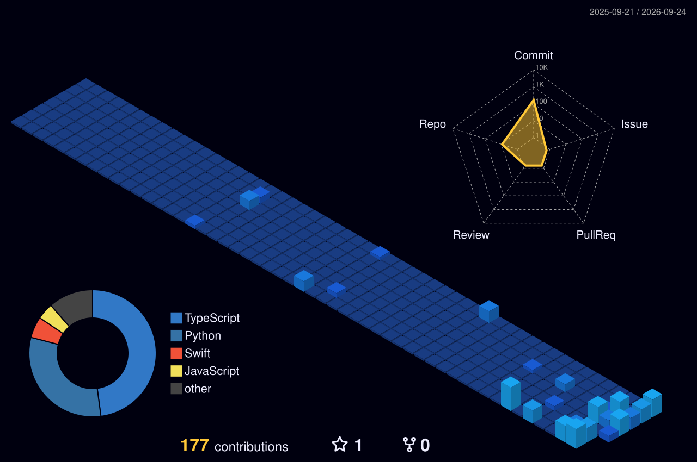

<!-- Header Image -->

  

<!-- Social Links (Ultra Minimal) -->

   
  
  

 

<!-- Modern Quote & 3D Elements -->

  
  
  
   
  <h3>❝ Great engineering is invisible. I build systems that just work. ❞</h3>

  

<!-- Grid Layout: About & Tech -->
<table align="center" style="border:none;">
  <tr>
    <td width="50%" valign="top">
      <h2>✦ The Developer</h2>
      

        I specialize in constructing scalable backend architectures and intuitive, high-performance interfaces. My approach is rooted in clean code, algorithmic efficiency, and an unwavering attention to detail. 
      

      

        When I'm not writing production-grade software, I thrive on spontaneous prototyping—exploring the boundaries of what's possible with modern web technologies and AI integration.
      

    </td>
    <td width="50%" valign="top">
      <h2>✦ The Toolkit</h2>
      
<b>Core:</b>  

      
<b>Web Ecosystem:</b>  

      
<b>Infrastructure:</b>  

    </td>
  </tr>
</table>

 

  

 

<h2 align="center">✦ Contribution Matrix</h2>

<i>Visualizing my GitHub activity over the past year.</i>

 

<!-- 3D Contribution Graph -->

  <picture>
    <source media="(prefers-color-scheme: dark)" srcset="./profile-3d-contrib/profile-night-view.svg">
    <source media="(prefers-color-scheme: light)" srcset="./profile-3d-contrib/profile-gitblock.svg">
    
  </picture>

 

  

 

<h2 align="center">✦ GitHub Achievements ✦</h2>

  

  

<!-- Footer -->

  

